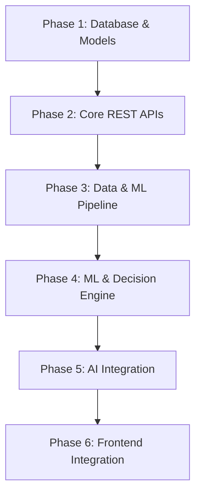

# EVision Telangana — Architecture Verification Summary

> **Architecture Verification Audit Summary**
> **Generated:** 2026-07-14
> **Scope:** Traceability and alignment verification of Backend, Frontend, Database, Data Engineering, and Machine Learning components
> **Verdict:** 🔴 CRITICAL GAPS — The system cannot serve production traffic today

---

## 1. Key Findings & Verdict

The EVision Telangana project has highly detailed documentation and a beautiful, visual frontend dashboard shell, but the backend implementation, database schema, data engineering pipelines, and machine learning models are **non-functional placeholders**.

### 1.1 Frontend Gaps (`frontend/src/App.jsx`)
* **Monolithic Assembly**: All 2,520 lines of frontend code are contained in a single monolithic `App.jsx` file. This violates the React modular file conventions specified in `05 - Repository Structure.md` and `10 - Coding Standards.md` (which mandate dividing pages into `src/pages/`, `src/components/`, `src/services/`, etc.).
* **Hardcoded Mock Data**: The frontend fetches no APIs at all. All charts, maps, dropdown values, and conversational assistant responses are powered by local mock variables (lines 52–585).
* **Blocked Features**: **49 out of 49** frontend features are blocked from functioning with real data.

### 1.2 Backend API Gaps (`backend/`)
* **Non-Functional Stubs**: All routes implemented under `backend/api/routes/` are empty FastAPI stubs returning either empty arrays `[]` or `None` values. None of them reference a database session, query any model, load serialized ML models, or coordinate with the AI Assistant.
* **Missing Routers**: The dashboard endpoints (`/dashboard/*`) defined in the API Spec are not implemented anywhere. The AI Assistant route file (`chatbot.py`) is an empty 0-byte file and is not registered in `main.py`.
* **Duplicate Routing**: Both `main.py` and `api/router.py` attempt to handle routing configuration redundantly.

### 1.3 Database Schema Gaps (`backend/models/` & `backend/database/`)
* **Empty Models**: All database models inside `backend/models/*.py` (e.g. `district.py`, `historical_demand.py`) are empty 0-byte files. No ORM logic exists.
* **Typo in Code**: The model file for application configuration is named `application_metadaata.py` (with a double 'a' typo).
* **No DB Initialization**: `database/initialization.py` is empty, and no SQLite `.db` file has been created.

### 1.4 Data Engineering & ML Gaps (`data/` & `scripts/`)
* **Missing Datasets**: 6 external datasets required by the Machine Learning Design specification do not exist anywhere in the project:
  1. *District Population Data*
  2. *District Urbanization Percentages*
  3. *Road Network Lengths*
  4. *Highway Lengths*
  5. *EV Registration Counts*
  6. *Traffic Volume & Income Indices*
* **Unbuilt ML Pipeline**: `scripts/feature_engineering.py` and `scripts/merge_datasets.py` are placeholder files. No Random Forest or XGBoost regression models have been trained or saved (`models/trained/` is empty). No K-Means clustering centroid files exist.

---

## 2. Generated Documentation Artifacts

Detailed audit reports have been compiled and generated within the `documentation/` directory:

1. **API Alignment Report**: [API_ALIGNMENT_REPORT.md](file:///Users/yudhin/api-alignment-audit/documentation/API_ALIGNMENT_REPORT.md)
   * Contains the complete 13-section audit including Frontend & Backend inventories, database mappings, missing datasets, recommended development order, risk assessments, and the final readiness scorecard.
2. **Traceability Matrix**: [TRACEABILITY_MATRIX.md](file:///Users/yudhin/api-alignment-audit/documentation/TRACEABILITY_MATRIX.md)
   * Provides the exact mapping trace requested: `Frontend Feature → Backend Endpoint → Database Tables → Dataset Columns → ML Output → Status` for all 49 frontend features.

---

## 3. Recommended Action Plan

To transition the system from mock-complete to operational, the development team must execute the following **6-phase development order**:

### Phase 1: Database & Models (Week 1)
* Implement ORM models inside `backend/models/*.py` matching database specifications.
* Fix typos in code names (`application_metadaata.py` → `application_metadata.py`).
* Write database session setup and initialization scripts to spin up `evision.db`.
* Seed baseline data into `districts` and `charging_stations` from interim CSVs.

### Phase 2: Core REST APIs (Week 2)
* Replace all backend stubs with real SQLModel database queries.
* Implement the missing `dashboard.py` router to handle overview stats, trend metrics, and station queries.

### Phase 3: Data & ML Pipeline (Week 3–4)
* Retrieve missing external datasets (population, EV registrations, road networks).
* Complete `scripts/merge_datasets.py` and `scripts/feature_engineering.py` to compile `data/processed/master_dataset.csv`.

### Phase 4: ML & Decision Engine (Week 4–5)
* Train and evaluate Random Forest and XGBoost regressors; serialize the champion model as `best_regression.joblib`.
* Code and compile K-Means clustering.
* Build the Decision Engine logic to calculate the District Priority Score (DPS) based on ML predictions and infrastructure gap analysis.

### Phase 5: AI Integration (Week 6)
* Integrate the Gemini API inside `chatbot.py` to enable conversational explanations.
* Leverage predictions, analytics, and recommendations tables to dynamically seed the chatbot's system prompt context.

### Phase 6: Frontend Integration (Week 7–8)
* Break down the monolithic 2,520-line `App.jsx` file into modular functional components under `src/pages/` and `src/components/`.
* Set up an Axios HTTP client and replace local state mock objects with active backend API hooks.
