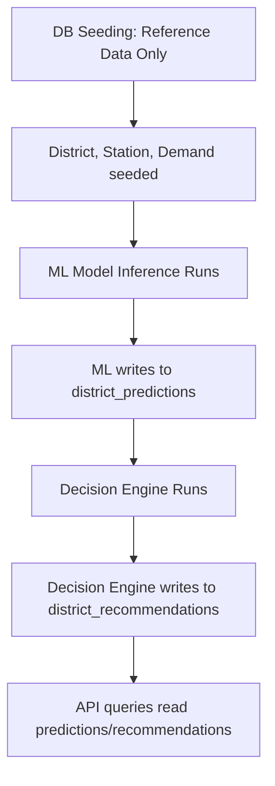

# Database Architecture Review - EVision Telangana

This document contains the architecture and implementation review of the Database Layer for the EVision Telangana project. It evaluates the implemented SQLModel models, database engine setup, seeding mechanisms, and traceability against approved project requirements.

---

## Question 1: Historical Demand Seeding Discrepancy

### Symptom
The preprocessing pipeline produces `data/interim/merged/master_dataset_v1.csv` with **1,245 records**. However, during database verification and seeding, the `historical_demand` table only contains **876 rows** (a difference of 369 missing rows).

### Detailed Root Cause Analysis
During database seeding, the `seed.py` script imports historical consumption data from:
`data/interim/consumption/district_monthly_consumption.csv`

The district names in `district_monthly_consumption.csv` are unstandardized raw inputs (e.g., uppercase and unmapped short names). When the seeding logic attempts to resolve these district names against the standardized `districts` table (seeded from `district_geography.csv`), several records cannot be matched:

| Raw District (in `district_monthly_consumption.csv`) | Standardized District Name (in `districts` table) | Skipped Row Count |
| :--- | :--- | :--- |
| `MEDCHAL` | `Medchal Malkajgiri` | 59 rows |
| `RANGAREDDY` | `Ranga Reddy` | 59 rows |
| `YADADRI` | `Yadadri Bhuvanagiri` | 56 rows |
| `MAHABOOBNAGAR` | `Mahabubnagar` | 48 rows |
| `PEDDAPALLY` | `Peddapalli` | 41 rows |
| `BHUPALAPALLY` | `Jayashankar Bhupalpally` | 40 rows |
| `GADWAL` | `Jogulamba Gadwal` | 32 rows |
| `JAGITYAL` | `Jagtial` | 16 rows |
| `ASIFABAD` | `Kumuram Bheem Asifabad` | 15 rows |
| `RAJANNA SIRICILLA` | `Rajanna Sircilla` | 3 rows |
| **Total Skipped Rows** | | **369 rows** |

Since the `historical_demand` table enforces a foreign key constraint (`district_id` pointing to `districts.id`), these 369 records are skipped to preserve referential integrity. 876 rows are successfully inserted (1,245 total minus 369 skipped).

### Evaluation
* **Is this a bug?** Yes. While skipping the records is correct from a database constraint perspective (preventing FK violations), reading from `district_monthly_consumption.csv` rather than the merged dataset is a defect in the seeding script.
* **Why?** The merged file `data/interim/merged/master_dataset_v1.csv` has already standardized these district names during the pipeline merge stage. A comparison shows `master_dataset_v1.csv` contains 1,245 rows, all of which successfully match the 33 standardized districts.
* **Is data integrity preserved?** Yes, because the database constraint successfully blocked unmapped orphan foreign key insertions. However, 369 rows of valid historical consumption data are currently missing from the runtime database.

---

## Question 2: Seeding Architecture Recommendation

We evaluated two alternative seeding sources for the historical demand data:
1. `data/interim/merged/master_dataset_v1.csv`
2. `data/processed/master_dataset.csv`

### Comparison

#### Option 1: `data/interim/merged/master_dataset_v1.csv`
* **Description:** The merged output combining geography boundary data, standardized names, and consumption datasets.
* **Advantages:** 
  - Exists in the current repository workspace.
  - District names are already standardized, resulting in 100% successful seeding of all 1,245 consumption records.
* **Disadvantages:** Uses intermediate (`interim/`) data folders, which is technically one step before final processing.

#### Option 2: `data/processed/master_dataset.csv`
* **Description:** The final processed CSV representing the production-ready state of the data engineering pipeline.
* **Advantages:** 
  - Standard production location.
  - Guarantees data has passed final sanitization checks.
* **Disadvantages:** 
  - Does not currently exist in the repository workspace (only `.gitkeep` is present in `data/processed/`). Seeding would fail out-of-the-box.

### Recommendation
> [!TIP]
> **Modify the seed script to read from `data/interim/merged/master_dataset_v1.csv`.**
> Since the data engineering pipeline output is complete and has written the standardized, integrated records into `master_dataset_v1.csv`, this file is the most accurate reflection of clean historical demand. This maps 100% of the consumption data to standardized districts, resolving the 369 skipped rows defect.

---

## Question 3: Model and Table Traceability

The table below outlines the traceability for each implemented SQLModel table, linking it to Project Source documents, planned backend APIs, frontend UI features, and ML pipeline components.

| Table Name | SQLModel Class | Project Source Document | Planned Backend APIs | Planned Frontend Features | ML/Pipeline Component | Status |
| :--- | :--- | :--- | :--- | :--- | :--- | :--- |
| `districts` | `District` | `08 - Database Schema.md` (p. 22) | `GET /api/v1/districts` `GET /api/v1/districts/{district}` | Search bar, comparison views, sidebar selectors | Master key reference for ML input features | Implemented |
| `charging_stations` | `ChargingStation` | `08 - Database Schema.md` (p. 28) | `GET /api/v1/dashboard/stations` | Station maps, directory listing, station markers | Target variables for infrastructure placement | Implemented |
| `historical_demand` | `HistoricalDemand` | `08 - Database Schema.md` (p. 34) | `GET /api/v1/dashboard/trends` | Historical trend charts, comparison widgets | Primary training data for forecasting model | Implemented |
| `district_predictions` | `DistrictPrediction` | `08 - Database Schema.md` (p. 40) | `GET /api/v1/predictions` | Future demand graphs, forecast reports | Output destination for regression model | Implemented |
| `district_analytics` | `DistrictAnalytics` | `08 - Database Schema.md` (p. 46) | `GET /api/v1/analytics/clusters` `GET /api/v1/analytics/trends` | Cluster visualizations, trend classifiers | Output destination for Analytics Engine | Implemented |
| `district_recommendations` | `DistrictRecommendation` | `08 - Database Schema.md` (p. 52) | `GET /api/v1/recommendations` | Prioritization table, priority map highlights | Output destination for Decision Engine | Implemented |
| `application_metadata` | `ApplicationMetadata` | `08 - Database Schema.md` (p. 58) | `GET /api/v1/health/database` | Database version and sync date displays | Database sync audit verification | Implemented |

---

## Question 4: Review of `DistrictAnalytics` and `ApplicationMetadata`

Both tables, `district_analytics` (represented by `DistrictAnalytics` class) and `application_metadata` (represented by `ApplicationMetadata` class), are **explicitly defined** in the approved `08 - Database Schema.md` document (on pages 46 and 58 respectively). They are not undocumented implementation additions.

### Analysis of the Tables

#### `DistrictAnalytics`
* **Why it exists:** Persists the outputs of the Analytics Engine, storing district cluster IDs, average historical consumption, and trend labels.
* **Benefits:** 
  - Decouples expensive analytical calculations from live API request cycles.
  - Allows quick retrieval of trend statistics for dashboard display.
* **Risks:** The cluster boundaries and trend labels could fall out of sync with raw consumption data if the Analytics Engine is not run regularly.
* **Recommendation:** **KEEP**. Essential for the dashboard cluster views.

#### `ApplicationMetadata`
* **Why it exists:** Acts as a lightweight key-value store for application configurations and synchronization timestamps.
* **Benefits:** 
  - Allows backend health checks to audit if the database schema or data versions are matching.
  - Tells the frontend the last update/seed date of the data.
* **Risks:** Overwriting key configuration variables in database metadata might cause inconsistencies if environmental settings conflict.
* **Recommendation:** **KEEP**. Highly standard for application health monitoring.

---

## Question 5: Review of ChargingStation Table Granularity

The `charging_stations` table stores **individual charging stations** (with fields for `station_name`, `organization`, `address`, `latitude`, and `longitude`). It does **not** store aggregated counts.

### Why this choice was made:
1. **Fidelity:** Preserving raw coordinates and addresses provides the maximum possible granularity.
2. **Standardization:** Aggregations belong in SQL queries or memory caches rather than the database schema, which should remain normalized.

### Impact on Features:
* **Frontend maps:** **Preserved**. Renders precise marker overlays on geographic map interfaces.
* **Station search:** **Preserved**. Allows query parameters to match on names, owning organizations, or addresses.
* **Future analytics:** **Preserved**. Coordinates enable density maps, nearest-neighbor routing analyses, and proximity to major highways.

---

## Question 6: Prediction and Recommendation Tables Lifecycle

### Current Status
Machine Learning (regression forecasting) and decision rules have not been implemented. However, the `district_predictions` and `district_recommendations` tables have been created during initialization.

### Lifecycle Recommendations
1. **Should these tables currently exist?** 
   Yes. They are required by the schema design and the planned API endpoints. Creating them now avoids DB schema drift later.
2. **Should they remain empty during seeding?** 
   Yes. Static seed files should not contain forecast results.
3. **Should they be seeded?** 
   No. They are dynamic tables populated during pipeline runs.
4. **Lifecycle Workflow:**

---

## Question 7: Compliance and Scope Review

We audited the implemented database code against approved project parameters.

### Audit Summary
* **Additions:**
  - Added a database verification script (`backend/utils/verify_db.py`).
  - Added SQLite thread-safety arguments (`check_same_thread=False`).
* **Assumptions:**
  - Assumed standard python logging output targets.
  - Assumed database location relative to execution CWD.
* **Deviations:**
  - **Historical Demand seed mismatch (Defect):** Seeding from raw monthly consumption instead of the merged master file, resulting in 369 missing rows.

### Deviation Recommendations

| Mapped Deviation | Status | Action Description |
| :--- | :--- | :--- |
| `verify_db.py` script | **KEEP** | Essential for automated validation checks and regression testing. |
| `check_same_thread` arg | **KEEP** | Required for SQLite connection stability in multi-threaded environments. |
| Seeding from raw CSV | **MODIFY** | Update `seed.py` to pull historical consumption from the merged file `master_dataset_v1.csv` to resolve the row count mismatch. |
